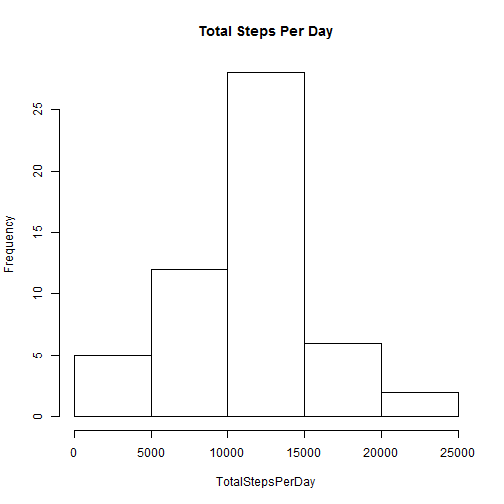
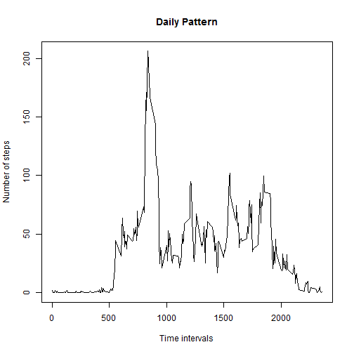
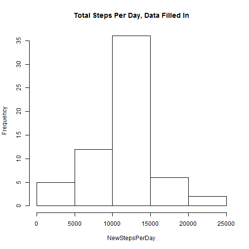
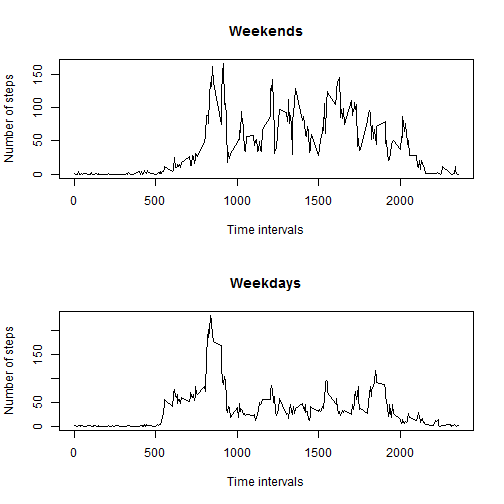

# Analysis of Activity Monitoring Data
Aleksandra Lyulko

## Introduction
The present document is an analysis of monitored activity data over 61 day.

## Loading and preprocessing the data
Load the data:


```r
activitydata=read.csv("repdata-data-activity\\activity.csv")
```

## What is the mean number of steps taken per day?
1) Calculate the total number of steps per day, using the 'tapply' function and date
as a factor:


```r
TotalStepsPerDay = tapply(activitydata$steps, activitydata$date, sum)
TotalStepsPerDay
```

```
## 2012-10-01 2012-10-02 2012-10-03 2012-10-04 2012-10-05 2012-10-06 
##         NA        126      11352      12116      13294      15420 
## 2012-10-07 2012-10-08 2012-10-09 2012-10-10 2012-10-11 2012-10-12 
##      11015         NA      12811       9900      10304      17382 
## 2012-10-13 2012-10-14 2012-10-15 2012-10-16 2012-10-17 2012-10-18 
##      12426      15098      10139      15084      13452      10056 
## 2012-10-19 2012-10-20 2012-10-21 2012-10-22 2012-10-23 2012-10-24 
##      11829      10395       8821      13460       8918       8355 
## 2012-10-25 2012-10-26 2012-10-27 2012-10-28 2012-10-29 2012-10-30 
##       2492       6778      10119      11458       5018       9819 
## 2012-10-31 2012-11-01 2012-11-02 2012-11-03 2012-11-04 2012-11-05 
##      15414         NA      10600      10571         NA      10439 
## 2012-11-06 2012-11-07 2012-11-08 2012-11-09 2012-11-10 2012-11-11 
##       8334      12883       3219         NA         NA      12608 
## 2012-11-12 2012-11-13 2012-11-14 2012-11-15 2012-11-16 2012-11-17 
##      10765       7336         NA         41       5441      14339 
## 2012-11-18 2012-11-19 2012-11-20 2012-11-21 2012-11-22 2012-11-23 
##      15110       8841       4472      12787      20427      21194 
## 2012-11-24 2012-11-25 2012-11-26 2012-11-27 2012-11-28 2012-11-29 
##      14478      11834      11162      13646      10183       7047 
## 2012-11-30 
##         NA
```

2) The difference between a histogram and a barplot is that a barplot creates 
bars of height corresponding to certain values, while the bars in a histogram
show the numbers of occurrencies of each value or the number of values in a 
certain interval.

Plot a histogram of total number of steps per day:


```r
hist(TotalStepsPerDay, main="Total Steps Per Day")
```

 

3) Calculate the mean and median of the total number of steps per day:


```r
MeanPerDay = mean(TotalStepsPerDay, na.rm=TRUE)
MedianPerDay = median(TotalStepsPerDay, na.rm=TRUE)
```
Mean number of steps per day: 1.0766189 &times; 10<sup>4</sup>.
Median number of steps per day: 10765.

## What is the average daily activity pattern?

1) Calculate a vector variable of the number of steps per each 5-minute interval,
averaged across all days and create a time series plot of the daily activity:


```r
DailyPattern=tapply(activitydata$steps, activitydata$interval, mean, na.rm=TRUE)
timeintervals=as.numeric(names(DailyPattern))
plot(timeintervals, DailyPattern, type='l', xlab='Time intervals',
ylab='Number of steps', main='Daily Pattern')
```

 

2) On average, the maximum number of steps is contained in the time interval '8:35':


```r
which.max(DailyPattern)
```

```
## 835 
## 104
```

## Imputing missing values

1) Calculate the total number of rows with missing values:


```r
nasteps = is.na(activitydata$steps)
MissingValuesSteps = sum(nasteps)

nadays = is.na(activitydata$date)
MissingValuesDate = sum(nadays)

naintervals = is.na(activitydata$interval)
MissingValuesInt = sum(naintervals)
```

The data have 2304 missing values in the 'steps' column, 
0 in the 'date' column and 0 column, i.e.,
only the number of steps are missing and the number rows with missing data is
2304.

2) Replace the missing steps data with the average value for this particular
time interval. The data for replacement are taken from the replicated Daily
Activity pattern.


```r
imputedata=activitydata$steps
replacedata=rep(as.numeric(DailyPattern), 61)
imputedata[is.na(activitydata$steps) == TRUE] = replacedata[is.na(activitydata$steps) == TRUE]
```

3) Create a new dataset that is equal to the original dataset but with the
missing data filled in:


```r
newdata=activitydata
newdata$steps=imputedata
```

4) Make a histogram of the total number of steps taken each day:


```r
NewStepsPerDay = tapply(newdata$steps, newdata$date, sum)
hist(NewStepsPerDay, main="Total Steps Per Day, Data Filled In")
```

 
Calculate the new mean and median number of steps per day:


```r
NewMeanPerDay = mean(NewStepsPerDay)
NewMedianPerDay = median(NewStepsPerDay)
```

The new mean number of steps per day is 1.0766189 &times; 10<sup>4</sup>, the new median 
number is 1.0766189 &times; 10<sup>4</sup>. The new mean is the same as before imputing
the data and the new median differs from the old median by only 1. Imputing 
the data had almost no impact on the new numbers.

## Are there differences in activity patterns between weekdays and weekends?

Create a new factor variable in the dataset with two levels – “Weekday” and
“Weekend” indicating whether a given date is a weekday or weekend day:


```r
dates=as.Date(newdata$date)
newdata$weekend = weekdays(dates)
newdata$weekend[newdata$weekend == "Monday"] = "Weekday"
newdata$weekend[newdata$weekend == "Tuesday"] = "Weekday"
newdata$weekend[newdata$weekend == "Wednesday"] = "Weekday"
newdata$weekend[newdata$weekend == "Thursday"] = "Weekday"
newdata$weekend[newdata$weekend == "Friday"] = "Weekday"
newdata$weekend[newdata$weekend == "Saturday"] = "Weekend"
newdata$weekend[newdata$weekend == "Sunday"] = "Weekend"
```

2) Panel plot containing a time series plot of the 5-minute interval (x-axis)
and the average number of steps taken on weekends and weekdays: 


```r
weekenddata=newdata[newdata$weekend == "Weekend",]
weekdaydata=newdata[newdata$weekend == "Weekday",]

AveWEnd=tapply(weekenddata$steps, weekenddata$interval, mean)
AveWDay=tapply(weekdaydata$steps, weekdaydata$interval, mean)

par(mfrow=c(2,1))
plot(timeintervals, AveWEnd, type='l', xlab='Time intervals',
ylab='Number of steps', main='Weekends')
plot(timeintervals, AveWDay, type='l', xlab='Time intervals',
ylab='Number of steps', main='Weekdays')
```

 


